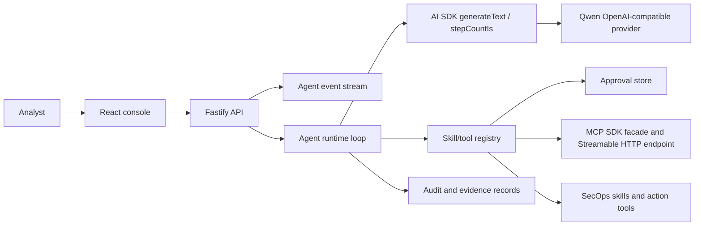

# Architecture

## Runtime Shape

## Boundary

The runtime owns conversation flow, permission context, and audit records. AI
SDK owns the model/tool loop. Skills own domain capability. The approval store
owns pending side-effecting calls. The MCP layer exposes both a web-console
inspection facade and a real SDK Streamable HTTP endpoint at `/api/mcp`.
Providers own remote model protocol details. The frontend renders state and
sends analyst intent, but it does not decide the agent's reasoning path or
replay tool arguments for approval.

`POST /api/agent/events` wraps the same `AgentRuntime` used by
`POST /api/agent/run`, but streams lifecycle events over `text/event-stream`.
The runtime still uses AI SDK `generateText`; events are emitted from the
runtime's model request, tool execution, audit, artifact, message, and final run
checkpoints. This keeps the agent loop SDK-owned while giving the console a
coding-agent style progress feed.

Agent run events are appended to a local JSONL audit log at
`SECOPS_AUDIT_LOG_PATH` and can be read through `GET /api/audit/events`. This is
local persistence for operator traceability, not a production SIEM or database.

## Tool Safety Classes

- `perception`: read or summarize local/sample facts.
- `reasoning`: transform observations into hypotheses or recommendations.
- `evidence`: package results for analyst review.
- `action`: side-effecting tools; controlled by `SECOPS_ACTION_LEVEL`.

The initial implementation includes controlled side effects:

- sandbox file writes for case notes
- preset local inspection commands
- a full-access exec tool that only runs when `SECOPS_ACTION_LEVEL=full-access`

`permissionMode=ask` turns every action tool into a pending approval. The
registry records the original API name, arguments, run context, and invocation
ID in memory. `approve` executes that saved call once with the same ID. `deny`
consumes the pending call without invoking the handler. `observe` and the
full-access action-level gate still take precedence over approval.

External MCP transport requests default to `permissionMode=ask`. This keeps the
real MCP endpoint useful for read-only tools while forcing side-effecting tools
through the same approval store used by the web console.

The API binds to `127.0.0.1` by default and enforces exact Host/Origin
allowlists before API or MCP handlers run. Remote exposure requires explicitly
setting `SECOPS_BIND_HOST` plus `SECOPS_ALLOWED_HOSTS` and
`SECOPS_ALLOWED_ORIGINS`.
