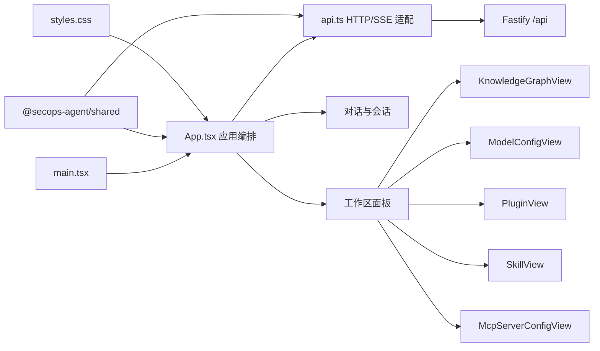
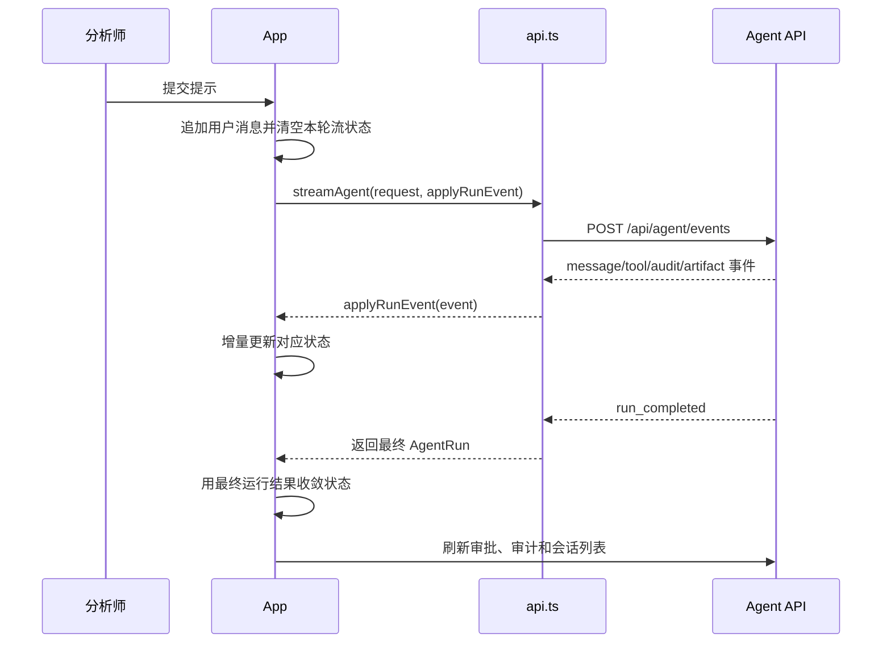

# 前端架构与后续修改入手指南

日期：2026-08-13

状态：当前实现说明

## 1. 文档目的

本文描述 `src/apps/web` 当前真实实现，供后续前端修改、故障定位和渐进式重构使用。内容包含：

- 前端技术栈与目录职责。
- 页面结构、状态来源和数据流。
- 本轮界面调整后的布局规则。
- 常见需求对应的代码入手点。
- 修改时必须保持的行为约束和验证方法。

领域术语以仓库根目录的 `CONTEXT.md` 为准。Skill、Plugin、Tool 和 MCP Server 是不同概念，前端不得为了展示方便混用名称或合并职责。

## 2. 技术栈与运行方式

前端是单页 React 应用：

| 项目 | 当前实现 |
| --- | --- |
| UI | React 19 |
| 构建 | Vite 7 |
| 语言 | TypeScript 5.9 |
| 图标 | `lucide-react` |
| 样式 | 原生 CSS，集中在 `styles.css` |
| 后端通信 | `fetch`、JSON、SSE 流 |
| 共享类型 | `@secops-agent/shared` |
| 测试 | `tsx` 执行静态标记和纯函数断言，随后运行 TypeScript 检查 |

源码开发从 `src/` 目录启动：

```powershell
npm run dev
```

- 前端默认地址：`http://localhost:5317`
- 后端默认地址：`http://127.0.0.1:4317`
- Vite 将 `/api` 代理到后端。
- `VITE_API_BASE_URL` 可在 Vite 启动前覆盖 API 地址。
- `VITE_API_TOKEN` 或浏览器存储中的令牌用于 API 鉴权。

不要直接修改 `src/apps/web/dist` 或 `runnable/app` 中的构建产物。正式修改只进入 `src/apps/web/src` 和相应测试。

## 3. 目录与模块职责

```text
src/apps/web/
├── src/
│   ├── main.tsx                 React 挂载入口和全局样式导入
│   ├── App.tsx                  应用编排、对话、会话、审批和多数工作区视图
│   ├── api.ts                   后端 HTTP/SSE 适配模块
│   ├── KnowledgeGraphView.tsx   知识图谱工作区
│   ├── ModelConfigView.tsx      模型连接配置工作区
│   ├── McpServerConfigView.tsx  独立 MCP Server 配置工作区
│   ├── PluginView.tsx           Plugin 目录工作区
│   ├── SkillView.tsx            Skill 目录与正文工作区
│   └── styles.css               全局 token、布局和全部功能样式
├── test/
│   └── App.test.tsx             当前前端回归测试入口
├── vite.config.ts               端口、缓存目录和 API 代理
└── package.json                 前端脚本和依赖
```

当前最重要的事实是：`App.tsx` 仍是应用级编排模块，同时包含一部分具体视图实现；`styles.css` 仍是单个全局样式文件。后续可以拆分，但修改时必须先按当前级联顺序和状态归属理解行为，不能假设项目已经采用路由器、状态库或 CSS Modules。

## 4. 整体结构



### 4.1 挂载入口

`main.tsx` 只负责三件事：

1. 创建 React 根节点。
2. 在 `React.StrictMode` 中渲染 `App`。
3. 导入全局 `styles.css`。

这里不是业务修改入口。除非调整应用级 Provider、错误边界或全局样式加载顺序，否则不要增加业务逻辑。

### 4.2 应用编排

`App.tsx` 当前负责：

- 首屏并行加载健康状态、Plugin、Skill、Tool、MCP Server、会话、审批和审计数据。
- 管理当前会话、历史会话和归档会话。
- 发起 Agent SSE 请求并合并增量事件。
- 管理 Tool 选择、权限模式和自动化访问级别。
- 处理审批、报告生成、报告导出和 MCP Tool 调用。
- 在对话视图与各工作区面板之间切换。
- 管理三个可拖拽尺寸：侧栏宽度、侧栏工作区高度、输入框高度。

`activePanel === null` 表示显示对话；非空时显示对应工作区。项目当前没有 URL 路由，刷新页面不会恢复工作区面板选择。

### 4.3 后端适配模块

`api.ts` 是前端访问后端的集中入口，其接口分为：

- 基础状态：健康状态、运行设置。
- Capability：Plugin、Skill、Tool、MCP Server。
- Agent：普通运行和 SSE 流运行。
- 会话：列表、详情、归档、恢复、删除。
- 安全控制：待审批项、允许、拒绝、审计事件。
- 输出：报告生成和导出。
- 配置：模型连接和 MCP Server 配置。

新增后端调用时，优先在 `api.ts` 增加有类型的函数，不要在视图内散落裸 `fetch`。跨前后端的数据结构优先定义在 `@secops-agent/shared`，只属于前端适配结果的类型可留在 `api.ts`。

## 5. 主要数据流

### 5.1 首屏加载

`App` 挂载后通过一个 `Promise.all` 并行请求主要数据，成功后一次性写入本地状态。任何一个请求失败都会进入页面级 `error`。

修改首屏请求时注意：

- 解构顺序必须与 `Promise.all` 参数顺序一致。
- 新增非关键数据时，应评估它是否值得阻塞整个首屏。
- Effect 使用 `mounted` 标志避免卸载后写状态，新增异步逻辑要保留清理行为。

### 5.2 对话运行与 SSE



`applyRunEvent` 按事件类型更新四类状态：

- `message` -> `messages`
- `tool` -> `streamToolInvocations`
- `audit` -> `streamAudit`
- `artifact` -> `streamArtifacts`

Tool 事件使用 `upsertInvocation` 按 ID 更新，因为同一个调用可能经历等待审批、执行中和完成等状态。不要把 Tool 事件直接无条件追加。

当前视图的数据优先级是：

```text
最终 lastRun > 当前流数据 > 已加载 activeSession > 空列表
```

修改活动、审计、证据或 Tool 调用展示时，必须检查这个优先级，避免历史会话数据覆盖正在流式产生的数据。

### 5.3 会话生命周期

- 新建会话：生成新的 UUID，清空运行、消息、流数据和 MCP 结果。
- 加载会话：读取详情，对消息 ID 防御性去重，再恢复运行和关联数据。
- 归档当前会话：先切换到新会话，再调用归档接口。
- 删除会话：用户确认后永久删除，再刷新活动与归档列表。
- 当前未持久化会话只有出现用户消息后才显示在左栏。

会话标题取首条用户消息，超过 20 个字符时截断。完整标题和显示标题是两个不同用途，不要用截断值替代原始内容。

## 6. 页面和布局模型

### 6.1 桌面 DOM 结构

`app-shell` 下有且只有三个直接布局项：

```text
app-shell
├── aside.sidebar
├── div.column-divider
└── main.main-panel
```

因此桌面 CSS Grid 必须始终存在三条轨道：

```css
grid-template-columns: var(--sidebar-width) 10px minmax(0, 1fr);
```

这是本轮“对话框无法正常显示在右侧”问题的根因约束。只要分隔条仍是独立同级元素，就不能把中等屏幕的 Grid 改成两列，否则 `main` 会自动排到下一行。

### 6.2 侧栏宽度与折叠

当前侧栏策略定义在 `App.tsx` 顶部常量与 `clampSidebarWidth` 中：

| 参数 | 值 | 含义 |
| --- | ---: | --- |
| 默认宽度 | 288px | 首次加载和双击恢复宽度 |
| 最窄展开宽度 | 176px | 保证品牌、会话和导航仍可读 |
| 折叠阈值 | 120px | 拖到该值或更小时吸附折叠 |
| 折叠宽度 | 0px | 侧栏完全隐藏 |
| 分隔条宽度 | 10px | 折叠后仍保留为恢复抓手 |
| 主区最小宽度 | 560px | 计算侧栏最大宽度时保留 |

状态通过 `--sidebar-width` 写入 `app-shell`，CSS Grid 消费该变量。拖拽使用 Pointer Events 和 pointer capture；React state 负责渲染，ref 保存同一拖拽过程中的最新宽度。

折叠状态必须同时满足：

- 网格侧栏轨道为 `0px`。
- `aside` 设置 `aria-hidden` 和 `inert`，内部控件退出辅助技术和键盘焦点序列。
- CSS 隐藏侧栏内容并禁用指针事件。
- 分隔条保持显示、可聚焦、可向右拖动恢复。
- `aria-valuenow`、`aria-valuetext` 和 `aria-expanded` 与真实状态一致。

键盘行为：

- `ArrowLeft`：缩窄；到达最窄展开宽度后再次按下会折叠。
- `ArrowRight`：加宽；折叠状态下恢复为 176px。
- `Home`：折叠。
- `End`：扩展到当前视口允许的最大宽度。
- `Enter` 或空格：在折叠和默认 288px 之间切换。
- 双击：恢复默认 288px。

### 6.3 响应式断点

| 视口 | 布局行为 |
| --- | --- |
| `> 1240px` | 三列桌面布局，默认侧栏 288px |
| `981px - 1240px` | 仍为三列，侧栏继续使用宽度变量 |
| `<= 980px` | 单列堆叠，隐藏纵向分隔条 |
| `<= 640px` | 隐藏会话列表，工作区导航改为紧凑网格 |

从折叠桌面缩放到 `980px` 以下时，代码会恢复侧栏宽度。原因是移动单列布局隐藏了纵向分隔条，若仍保持 `0px`，用户将没有恢复入口。

修改断点时至少验证 `1440px`、`1080px`、`900px` 和 `640px`。必须检查：

- 右侧对话是否与侧栏处于同一行。
- `main.left` 是否等于 `divider.right`。
- 页面是否产生横向溢出。
- 折叠与恢复后 ARIA 数值是否和实际宽度一致。
- 移动单列中侧栏是否可见且对话位于其下方。

### 6.4 另外两个拖拽区域

侧栏内部的水平分隔条调整“会话列表/工作区导航”高度；对话输入框顶部的水平分隔条调整 textarea 高度。三套拖拽逻辑结构相似，但方向、范围和响应式策略不同。

修改任一拖拽区域时保留：

- `pointerdown` 时 `setPointerCapture`。
- `pointerup` 和 `pointercancel` 均结束拖拽。
- 结束时释放 pointer capture。
- 键盘 separator 行为和 `aria-value*`。
- 视口变化后的重新钳制。

## 7. 当前视觉实现

颜色、圆角和阴影优先修改 `styles.css` 顶部 token。不要在新功能中随意加入第二套高饱和主色或重复定义近似 token。

## 8. 常见修改的入手点

| 修改目标 | 首要入口 | 同时检查 |
| --- | --- | --- |
| 左右分栏、侧栏折叠 | `App.tsx` 的 `SIDEBAR_*`、`handleColumnResize*` | `.app-shell`、`.sidebar`、`.column-divider`、1240/980px 断点、测试 |
| 侧栏会话和导航 | `App.tsx` 的 sidebar JSX、`WorkbenchPanel` | `panelTitle`、`panelSubtitle`、`openPanel`、`.nav-*` |
| 对话消息展示 | `TranscriptMessage`、`renderMarkdown` | `.message*`、`.tool-message*`、滚动逻辑 |
| Agent 提交和流事件 | `submit`、`applyRunEvent` | `api.ts` 的 `streamAgent`、共享事件类型、状态优先级 |
| 输入框和权限菜单 | composer JSX、`handleComposerResize*` | `.composer*`、`permissionMode`、`actionLevel` |
| 会话管理 | `loadSession`、`startNewSession`、归档/删除函数 | `api.ts` 会话函数、标题生成、滚动恢复 |
| Tool 范围 | `enabledTools`、`toggleTool`、`togglePlugin` | `reconcileEnabledTools`、完全访问模式、Plugin reload |
| 审批 | `applyApprovalResult`、`ToolCallCard` | 待审批刷新、Tool invocation upsert、审计刷新 |
| Plugin 页面 | `PluginView.tsx` | Plugin reload 后 Tool/Skill/MCP 同步 |
| Skill 页面 | `SkillView.tsx` | 正文按需读取、可见性开关、Skill reload |
| Tool/MCP 页面 | `App.tsx` 中 tool workspace、`McpServerConfigView.tsx` | `api.ts` MCP 配置与 Tool 刷新 |
| 模型配置 | `ModelConfigView.tsx` | `api.ts` 模型配置函数、健康状态刷新 |
| 知识图谱 | `KnowledgeGraphView.tsx` | `.kg-*` 样式、节点/边数据构建、缩放和平移 |
| 仪表盘、报告、审计、证据 | `App.tsx` 内对应视图函数 | `active*` 数据优先级、报告 API、复制状态 |
| 全局主题和控件 | `styles.css` 顶部 token 与基础选择器 | 现有焦点样式、错误/警告语义色、所有断点 |

## 9. 后续修改的注意事项

### 9.1 不要破坏 Capability 语义

- Plugin 是分发容器。
- Skill 是指令包。
- MCP Server 提供 Tool。
- Tool 是模型可调用的执行入口。
- Capability 只用于发现和展示，不等同于权限。

Tool 是否展示、是否延迟加载、是否允许执行是不同维度。前端开关变化必须调用对应接口，不能仅隐藏 UI 制造“已禁用”的假象。

### 9.2 不要混淆实时状态与持久化状态

一次 Agent 运行同时存在历史会话、当前 SSE 增量和最终运行结果。任何新视图都应明确读取哪一层；不要简单把所有数组拼接，否则容易出现重复消息、重复 Tool 调用或旧证据覆盖新证据。

### 9.3 保持可访问交互完整

所有自定义 separator、菜单、切换控件和图标按钮都需要：

- 可见焦点。
- 键盘等价操作。
- 与视觉状态一致的 ARIA 属性。
- 折叠/隐藏后不可继续聚焦。
- 禁用状态下不响应操作。

折叠侧栏不能只做 `width: 0`；否则内部可聚焦控件仍可能被 Tab 访问。

### 9.4 CSS 修改要先看级联顺序

`styles.css` 包含基础规则、功能规则和多个分散的响应式块。同一个选择器可能在文件后部被覆盖。修改前使用 `rg` 查找选择器的全部定义，不要只改第一次出现的位置。

特别注意：

- 1240px 与 980px 是主布局断点。
- 860px、820px 和 640px 还有功能级断点。
- `main-panel.config-mode` 与普通对话模式的 padding 和滚动策略不同。
- 固定高度区域必须保留 `min-height: 0`，否则内部滚动容器可能被内容撑开。

### 9.5 Windows 与仓库约束

- 命令使用 PowerShell 语法，不使用 Bash 引号或转义习惯。
- `rg` 搜索通配目录前先用 `Get-ChildItem -Filter` 展开路径。
- 临时产物放在项目内的 `.codex-temp/<用途>` 或 `output/<用途>`，不要直接放到 `C:\tmp`。
- 正式文档使用 Markdown，不使用 HTML。
- 不修改运行时数据、`dist` 或 `runnable` 编译输出作为源码修复。

## 10. 建议的渐进式改进顺序

以下是后续可实施方向，不代表当前已经完成。

### 10.1 先加真实布局回归测试

当前 `App.test.tsx` 对布局的保护主要是读取 CSS 文本并断言关键三列规则。这能防止已知错误回归，但不能证明浏览器最终几何正确。

优先增加浏览器级用例，覆盖：

1. `288px -> 176px` 拖窄。
2. 越过 `120px` 后折叠到 `0px`。
3. 从左缘分隔条向右拖动恢复。
4. 折叠后切换到 `<= 980px` 自动恢复。
5. 对话区与分隔条始终相邻且无横向溢出。

### 10.2 提取可调整面板策略模块

侧栏、工作区高度和输入框高度存在相似的 pointer/keyboard/ARIA 行为。适合先提取纯计算策略，再考虑复用交互 hook。

建议模块接口只暴露“把请求值解析为合法布局状态”，隐藏阈值、钳制和吸附实现。这样测试可直接穿过同一个接口验证拖拽和键盘行为，获得更好的局部性。不要先创建大量只有一行转发逻辑的浅模块。

### 10.3 拆分 App 编排与功能视图

`App.tsx` 体积较大，优先按拥有完整状态和行为的功能切片拆分，而不是按 JSX 长度拆分：

- `useAgentSession`：提交、SSE 事件合并、当前运行和会话切换。
- `useWorkspaceLayout`：三套尺寸状态与交互。
- `ConversationWorkspace`：对话记录、Tool 调用和输入框。
- `WorkspaceSidebar`：会话列表与工作区导航。
- 报告、审计、证据和仪表盘视图移入独立文件。

每次只移动一个职责，并确保模块接口比内部实现小。不要同时重写状态管理、样式命名和布局，否则难以定位回归。

### 10.4 按功能拆分样式

样式拆分应保持一个明确的导入顺序，例如：

```text
tokens.css
base.css
shell.css
conversation.css
workspace-panels.css
knowledge-graph.css
responsive.css
```

拆分前先记录重复选择器和覆盖关系。机械移动规则后先做视觉对比，再重构 token 或选择器，避免同时改变级联和视觉结果。

### 10.5 评估布局偏好持久化

侧栏宽度、折叠状态和输入框高度当前只保存在 React 状态中，刷新后恢复默认值。若要持久化，建议统一定义版本化的布局偏好结构，并在读取时继续通过钳制函数校验，避免旧值在新断点下造成不可恢复布局。

## 11. 验证清单

每次前端修改至少运行：

```powershell
cd src
npm run test -w @secops-agent/web
npm run build -w @secops-agent/web
```

涉及布局、交互或响应式时，再进行浏览器验证：

- 桌面宽屏：1440 x 900。
- 紧凑桌面：1080 x 720。
- 单列断点：900 x 800。
- 移动宽度：640px 或更窄。
- 页面控制台无 error/warning。
- 主要操作前后无横向溢出和内容重叠。
- 动态内容不会改变固定工具栏、分隔条或输入框的尺寸。

涉及本轮侧栏功能时，额外检查：

- 176px 状态文字仍可读。
- 120px 阈值吸附到 0px。
- 折叠后主区只保留 10px 抓手。
- 鼠标和键盘都可恢复。
- ARIA 数值与实际几何一致。
- `<= 980px` 时侧栏自动恢复且分隔条隐藏。

## 12. 最短上手路径

首次接手一个前端需求时，按以下顺序阅读：

1. `CONTEXT.md`，确认领域术语。
2. `src/apps/web/src/App.tsx` 顶部类型、常量和状态区。
3. 目标功能对应的独立 View 文件或 `App.tsx` 内视图函数。
4. `src/apps/web/src/api.ts` 中对应的数据接口。
5. `src/apps/web/src/styles.css` 中该选择器的全部定义和相关断点。
6. `src/apps/web/test/App.test.tsx` 中现有行为约束。
7. 修改后执行测试、构建和目标视口浏览器验证。

对布局问题，第一步不是调消息气泡或局部宽度，而是先检查 DOM 同级项数量、Grid 轨道数量、`min-width: 0`、滚动容器和当前命中的媒体查询。
